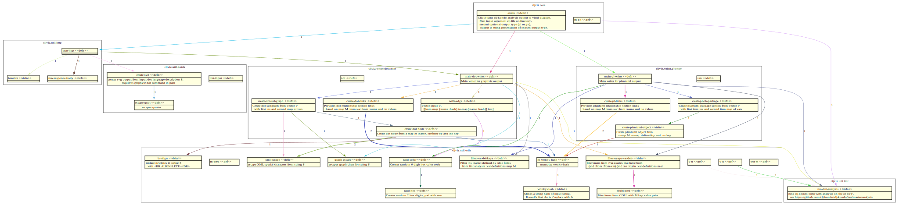

# cljviz

Cljviz turns your clojure project's clj-kondo analysis output to visual diagram.

>**NOTE**
>cljviz is **alpha** code and made as a clojure learning project. 

## Installation

Download code and see Usage/Options below.
You will need [plantuml](https://plantuml.com) and/or [graphviz](https://graphviz.org) tools. Graphviz `dot`-command needs to be in PATH. Image viewer is also needed.

## Usage

Input options for cljviz are clj-file or source directory and optionally output type (`pl`) | `gv` | `ws`).
Cljviz output (stdout) can be plantuml or graphviz (dot-language) description.
Without options static svg diagram will be created in http://localhost:3000 and with ws option there is automatically updating diagram in http://localhost:3000/ui.

### Browser output (static)

Change to download directory and run

    $ lein run <clojure project clj-file or src-dir>

Open http://localhost:3000 with browser. The diagram is based on code state at the moment of starting cljviz. 

### Browser output (live)

Change to download directory and run

    $ lein run <clojure project clj-file or src-dir> ws

Open http://localhost:3000/ui with browser. The diagram should update when vars and namespaces are updated in code repo cljviz is watching.

### Plantuml output

Change to download directory and run

    $ lein run <clojure project clj-file or src-dir> pl > example.plantuml

Then plantuml is needed to turn output into e.g. a png image

    $ plantuml example.plantuml

Open resulting example.png image with image viewer.

### Graphviz output

Change to download directory and run

    $ lein run <clojure project clj-file or src-dir> gv > example.gv

Then graphviz dot-command is needed to turn output into e.g. a png image

    $ dot -v -Tpng -oexample.png example.gv

Open resulting example.png image with image viewer.

## Options

Options cannot be combined
- (no options): static diagram for browsing
- pl: plantuml std output, runs and quits
- gv: graphviz std output, runs and quits
- ws: "live" updating diagram for browsing

## Known issues

- Generated diagram resembles an UML class diagram, which is obviously wrong in clojure context.

- If your project is big, plantuml may run out of memory and part of image will not be generated. Try to give more memory to plantuml with e.g.

    $ export PLANTUML_LIMIT_SIZE=12288

- Tested only in linux.

## Future plans

- move from plantuml to plain graphviz (added option)
- generate web output for browser usage, maybe imagemap based (added basic svg and live updates)
- proper cli arg support
- template based output format
- namespace only view

### About clj-kondo

clj-kondo can be installed as leiningen plugin as described in https://github.com/clj-kondo/lein-clj-kondo

How to run clj-kondo analysis from cli

    $ lein clj-kondo --lint ./src/cljviz/core.clj --config '{:analysis true :output {:format :edn}}'

Analysis output can be redirected with standard shell output redirection. Output pretty printing can be done with Calva command for replacing current form with pretty printed form.

## License

MIT License